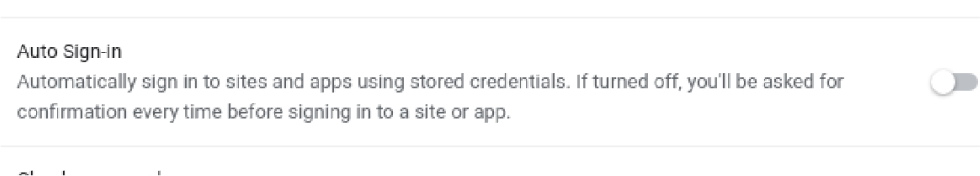

# 关闭自动登录功能

## 操作步骤

- 在右上角，依次点击“个人资料”图标 个人资料 接着点按“密码”图标 密码。
  如果系统没显示您的 Google 帐号，请了解如何在 Chromium 中开启同步功能。
  如果找不到“密码”图标，请改为在屏幕右上角依次点击“更多”图标 整理 然后 设置 然后 自动填充 然后 密码管理工具。
- 关闭自动登录。

## 预期结果

自动登录功能被关闭。

