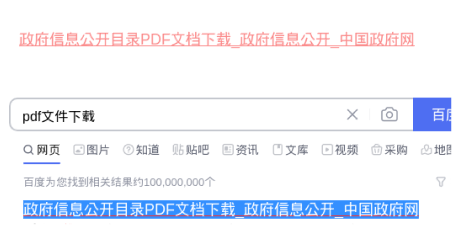

# 在 Chromium 中分享或链接到引文和文本

## 操作步骤

- 转到包含想分享的文本的页面。
- 如需突出显示想分享的文本，请点击并按住，然后拖动鼠标。
- 如需打开上下文菜单，请右键点击突出显示的文本。
- 选择复制指向突出显示的内容的链接。
  如果无法选择此选项，则意味着该功能可能不适用于所选内容。
- 将链接粘贴到任意位置，例如电子邮件或会话集内。

## 预期结果

选择的文本被分享到选择的位置。

