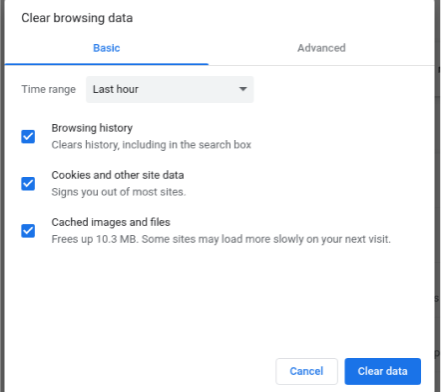

# 清除历史记录

## 操作步骤

- 点击右上角的“更多”图标。
- 依次点击历史记录 > 历史记录。
- 点击左侧的清除浏览数据。此时，系统会显示一个方框。
- 从下拉菜单中选择您要删除的历史记录范围。要清除所有内容，请选择时间不限。
- 选中您希望 Chromium 清除的信息所对应的方框，包括“浏览记录”。详细了解可删除的浏览数据的类型
- 点击清除数据。

## 预期结果

所选数据被清除。

