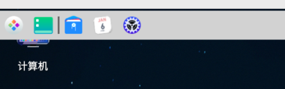

# 任务栏查看

## 操作步骤

登录成功，进入系统桌面

## 预期结果

任务栏从左往右由以下五个部分组成：

1. “启动器” 图标、“显示桌面” 插件图标；
2. 应用程序，包括已经打开的以及驻留在任务栏的；
3. “系统托盘” 区域，显示当前系统状态及个别应用状态信息；
4. “其它插件” 区域，用于快速打开某些系统功能。
5. “速览桌面” 区域（仅适用于 “高效模式” 任务栏）

