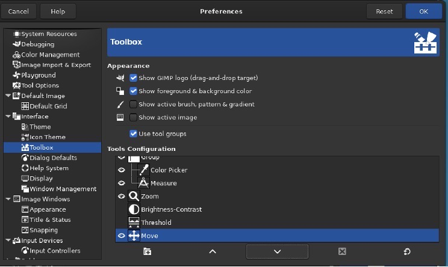

#  GIMP 工具箱

## 摘要

工具箱是 GIMP 的核心。这是您将在那里找到的内容的快速浏览。

## 操作步骤

在工具箱中，与 GIMP 的大多数部分一样，将鼠标移到某物上并让它停留片刻，通常会显示一个描述该物的“工具提示” 。快捷键也经常显示在工具提示中。在许多情况下，您可以将鼠标悬停在某个项目上并按F1键以获取有关鼠标下方事物的帮助。

默认情况下，只有 Foreground-background 图标可见。您可以通过Edit → Preferences → Toolbox : Tools configuration添加 Brush-Pattern-Gradient 图标和 Active Image 图标。

## 预期效果

各个子功能正常。

## 其他说明

无。
