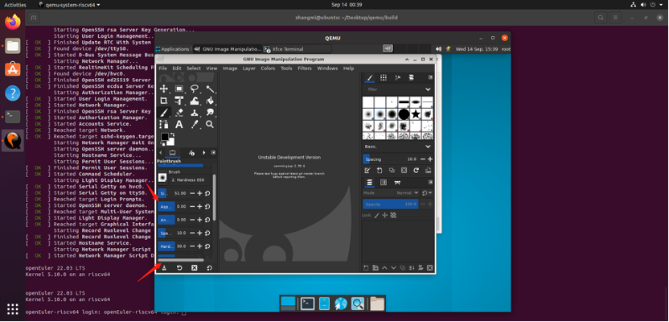

# 单窗口模式

## 摘要

关于 GIMP 中的单窗口模式的介绍。

## 操作步骤

点击 Single-Window model ，显示如下图所示：

您会发现相同的元素，但管理方式不同：

左右面板固定；你不能移动它们。但是您可以通过拖动鼠标指针越过左窗格的右边框时出现的移动指针来减小或增加它们的宽度。如果您想保持左侧窗格较窄，请使用工具选项底部的滚动条来平移选项显示。

如果您减小多标签停靠栏的宽度，则可能没有足够的空间容纳所有标签；然后出现箭头，允许您滚动选项卡。

与多窗口模式一样，您可以使用 Tab 键屏蔽这些面板。

勾选 Hide Docks 。

勾选后显示屏蔽后的界面。

图像窗口占据了两个面板之间的所有空间。

打开多个图像时，图像窗口上方会出现一个新栏，每个图像都有一个选项卡。您可以通过单击选项卡或使用 Ctrl+Page Up 或 Page Down 或 Alt+Number 在图像之间导航。 “编号”为标签编号；您必须使用键盘上一行的数字键，而不是小键盘的数字键（某些国家键盘需要 Alt+Shift）。

这是一个最小的设置。GIMP 有十多种其他类型的对话框用于各种目的，但用户通常在需要时打开它们，并在完成时关闭它们。知识渊博的用户通常会始终打开工具箱（带有工具选项）和图层对话框。工具箱对于许多 GIMP 操作都是必不可少的。工具选项部分实际上是一个单独的对话框，在屏幕截图中显示停靠在主工具箱上。知识渊博的用户几乎总是以这种方式进行设置：如果不了解他们的选项是如何设置的，就很难有效地使用工具。当您使用具有多个图层的图像时，“图层”对话框会发挥作用：在您超越 GIMP 专业知识的最基本阶段之后，这意味着几乎总是如此。当然，它有助于在屏幕上显示您正在编辑的图像；如果您在保存工作之前关闭图像窗口，GIMP 会询问您是否要关闭文件。

## 其他说明

无。
