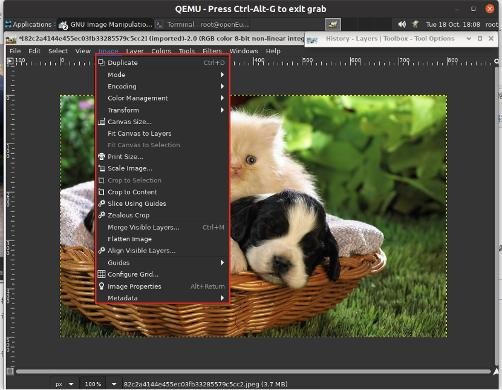
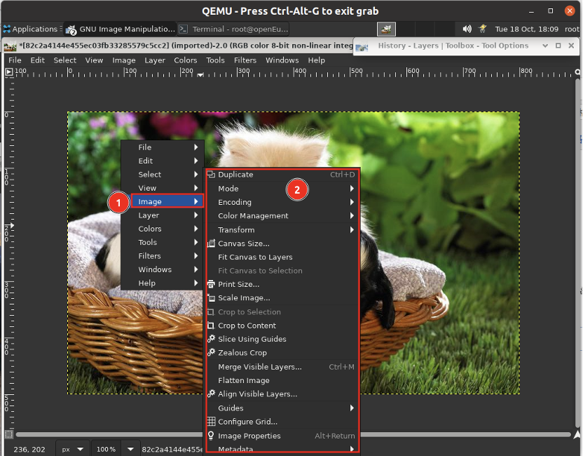

# 图像菜单

## 摘要

打开 GIMP 中的图像菜单。

## 操作步骤

直接在标题栏下方出现菜单栏（除非它被抑制）。图像菜单提供了对您可以对图像执行的几乎所有操作的访问。您还可以右键单击图像以显示弹出图像菜单[1]，或左键单击左上角的小“箭头”符号，称为“菜单按钮”，如下所述。许多菜单命令也与菜单中所示的键盘快捷键相关联。如果在“首选项”对话框中启用“使用动态键盘快捷键” ，您可以为菜单操作定义自己的自定义快捷键。

## 预期效果

在图像上右键弹出菜单

## 其他说明

无。
