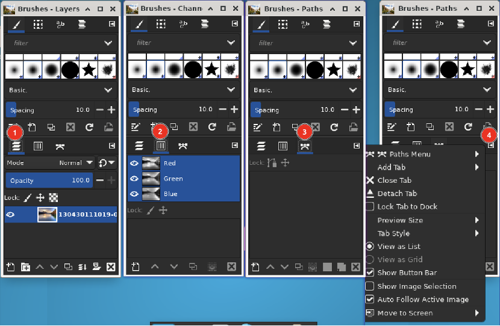

# 图层、通道、路径

## 摘要

GIMP 中的图层、通道、路径。

## 操作步骤

## 

画笔对话框下方的停靠对话框显示了用于管理图层、通道和路径的对话框（选项卡）。

图层选项卡已打开：它显示当前活动图像的图层结构，并允许以多种方式对其进行操作。

可以不使用图层对话框来做一些非常基本的事情，但即使是中等复杂的 GIMP 用户也发现始终使用图层对话框是必不可少的。

## 其他说明

无。
