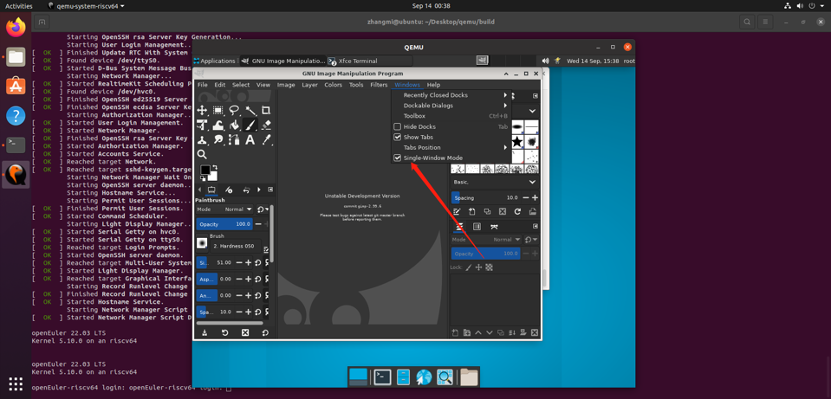

# 多窗口模式

## 摘要

GIMP 的多窗口模式。

## 操作步骤

上面的屏幕截图显示了可以有效使用的 GIMP 最基本的多窗口排列。

您将看到两个面板，左侧和右侧，中间有一个图像窗口。第二个图像被部分屏蔽。左侧面板包含工具箱以及工具选项、设备状态、撤消历史记录和图像对话框。右侧面板在多选项卡停靠中包含画笔、图案、字体和文档历史对话框，在另一个多选项卡停靠中包含图层。

## 预期效果

## 其他说明

无。
