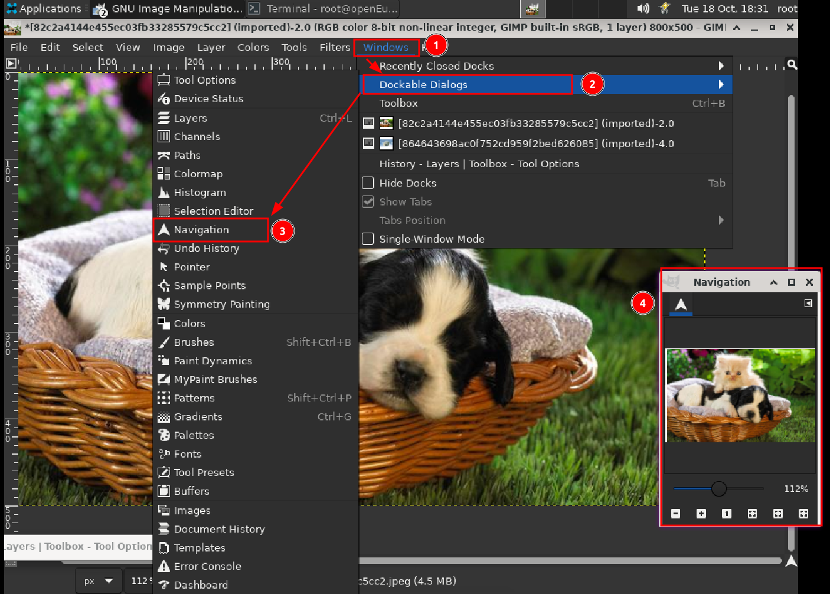
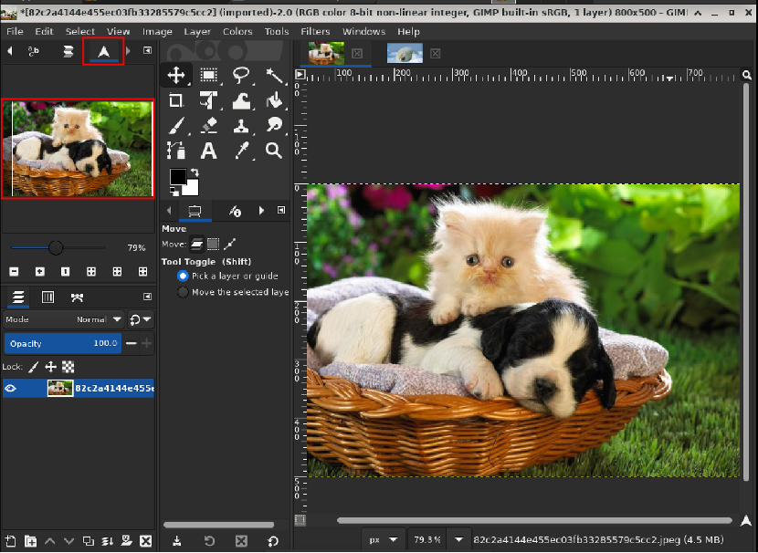
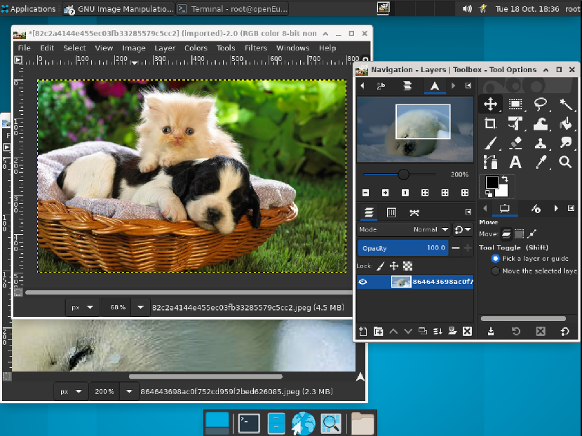

# 对话框

## 摘要

GIMP 在您的屏幕上安排对话框方面具有很大的灵活性。“对话框”是一个包含工具选项或专用于特殊任务的移动窗口。“ dock ”是一个容器，可以保存一组持久性对话框，例如“工具选项”对话框、“画笔”对话框、“调色板”对话框等。但是，Docks 不能保存非持久性对话框，例如“首选项”对话框或“图像”窗口。

在这些扩展坞中，每个对话框都位于其自己的选项卡中。

在多窗口模式下，工具箱是实用程序窗口而非停靠栏。在单窗口模式下，它属于单窗口。

## 操作步骤

使用 Windows -> Dockable Dialogs 查看可停靠对话框的列表。从列表中选择一个可停靠对话框以查看该对话框。如果该对话框在停靠栏中可用，则使其可见。如果对话框不在停靠栏中，则在多窗口和单窗口模式下的行为是不同的：

在多窗口模式下，屏幕上会出现一个包含对话框的新窗口。

在单窗口模式下，对话框作为选项卡自动停靠到画笔-文档历史停靠。

## 预期效果

各个子功能运作正常。

## 其他说明

无。
