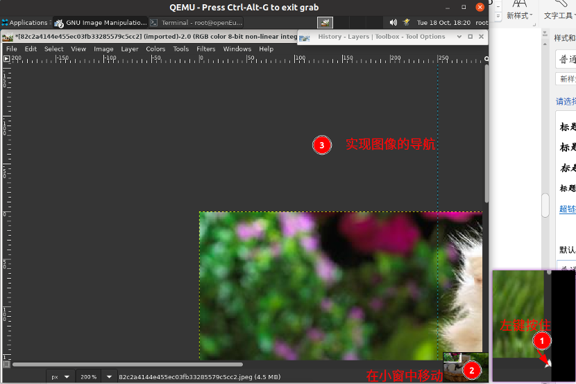

# 导航控件

## 摘要

关于 GIMP 中的导航控件说明。

## 操作步骤

这是图像显示右下角的一个小十字形按钮。在导航控件上单击并按住（不要松开鼠标按钮）以显示导航预览。导航预览具有图像的微型视图，显示区域的轮廓。使用导航预览快速平移到图像的不同部分——按住按钮移动鼠标。导航窗口通常是在只显示一小部分的大图像中快速导航的最便捷方式。（有关访问导航窗口的其他方式，请参见导航对话框）。（如果您的鼠标有一个中键，请单击并拖动它以平移图像）。

## 预期效果

功能正常运行。

## 其他说明

无。
