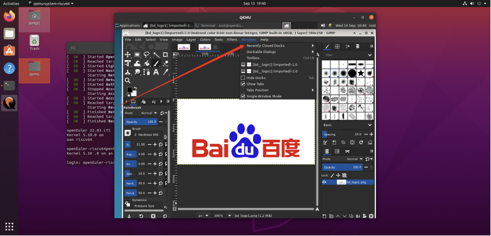

# 找回丢失的窗口

## 摘要

找回丢失的窗口。

## 操作步骤

如果您的 GIMP 布局丢失，您可以使用 Windows -> Recently Closed Docks 轻松恢复您的布局。

## 预期效果

找回丢失的窗口功能正常。

## 其他说明

 Windows 菜单命令仅在图像打开时可用。要从停靠栏添加、关闭或分离选项卡，请单击对话框右上角的。这将打开选项卡菜单。选择添加选项卡、关闭选项卡或分离选项卡。
