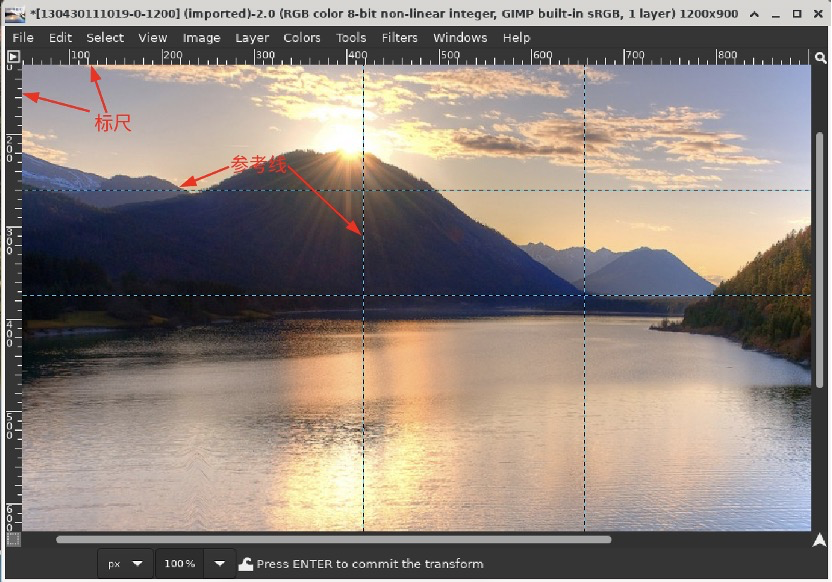

# 标尺

## 摘要

标尺最重要的用途之一是创建指南。单击并将标尺拖动到图像中以创建指南。参考线是一条线，可帮助您准确定位事物 - 或验证另一条线是否真正水平或垂直。使用移动工具，您可以单击并拖动参考线。将参考线拖出图像以将其删除；您可以随时将另一个指南拖到图像中。您甚至可以同时使用多个指南。

## 操作步骤

在标尺区域，鼠标指针位置用两个垂直和水平指向的小箭头标记。

## 预期效果

各个子功能正常运行。

## 其他说明

无。
