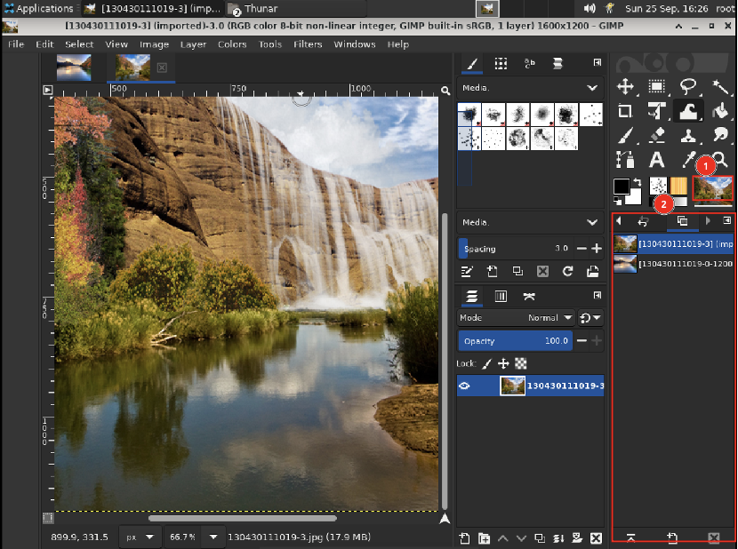

# 活动图像

## 摘要

GIMP 中的活动图像。

## 操作步骤

在 GIMP 中，您可以一次处理多个图像，但在任何给定时刻，只有一个图像是“活动图像”。在这里，您可以找到活动图像的小图标表示。单击该图标可显示包含当前打开图像列表的对话框，单击对话框中的图像使其处于活动状态。通常，您单击多窗口模式下的图像窗口或单窗口模式下的图像选项卡，使其成为活动图像。

## 预期效果

## 其他说明

无。
