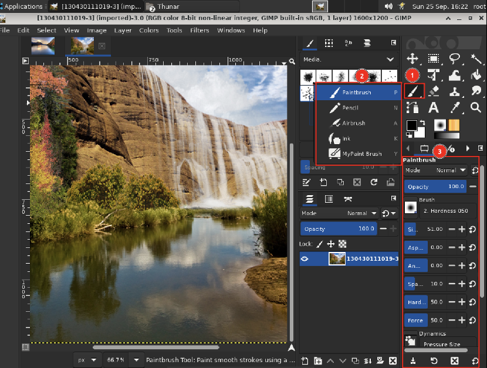

# 画笔/图案/渐变

## 摘要

使用 GIMP 中的画笔/图案/渐变。

## 操作步骤

这里的符号向您展示了 GIMP 当前的选择： 画笔，被所有允许您在图像上绘画的工具使用（顺便说一下， “绘画”包括擦除和涂抹等操作）；对于图案，用于填充图像的选定区域；对于渐变，每当操作需要平滑变化的颜色范围时，它就会发挥作用。单击这些符号中的任何一个都会弹出一个对话框窗口，允许您对其进行更改。

## 预期效果

各个子功能正常运行。

## 其他说明

无。
