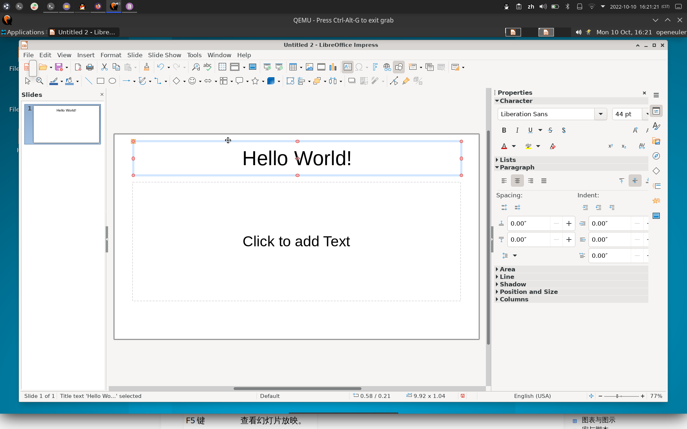

# 使用快捷键

## 摘要

使用快捷键。

## 操作步骤

| F2 键         | 退出文本。       |
| ------------- | ---------------- |
| F3 键         | 进入组合。       |
| Ctrl+F3       | 退出组合。       |
| Shift+F3      | 副本             |
| F4 键         | 位置与大小       |
| F5 键         | 查看幻灯片放映。 |
| Ctrl+Shift+F5 | 导航             |
| F7 键         | Spelling         |

## 预期结果

正常使用快捷键。

## 其他说明

无。
