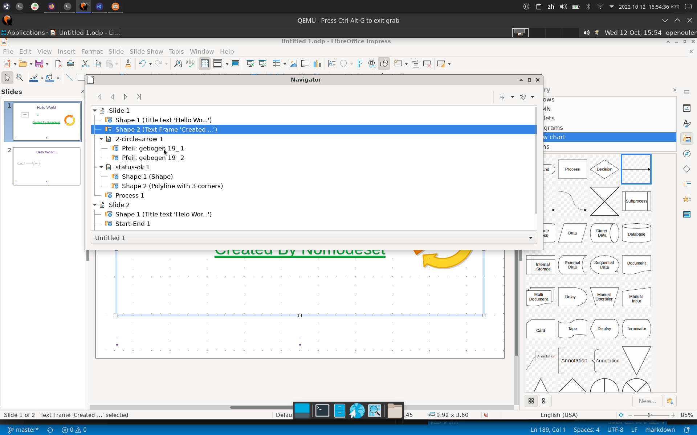

# 导航

## 摘要

打开「导航」，您可以在其中快速跳转到其他幻灯片，或者在打开的文件之间快速切换。

You can [dock](https://help.libreoffice.org/latest/zh-CN/text/shared/00/00000005.html?&DbPAR=IMPRESS&System=UNIX#docking) the Navigator to the edge of your workspace.

## 操作步骤

要访问此命令...

Choose **View - Navigator**.

在「**标准**」栏上，点击导航打开/关闭。

## 预期结果

可以在其中快速跳转到其他幻灯片，或者在打开的文件之间快速切换。

## 其他说明

无。
