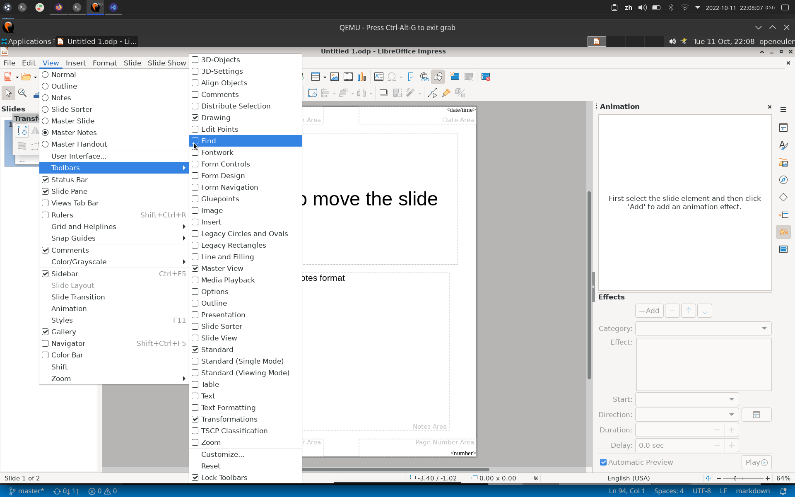

# 工具栏设置选项

## 摘要

打开子菜单，以显示或隐藏工具栏。 

## 操作步骤

打开子菜单，以显示或隐藏工具栏。 工具栏是用于显示可以快速访问 LibreOffice 中的某些命令的图标区域。

打开一个对话框，您可以在其中添加、编辑和删除图标。

选择「**视图 - 工具栏 - 重置**」可以将工具栏重置为默认的上下文敏感行为。部分工具栏将根据上下文自动显示。

## 预期结果

工具栏所有按钮均可增删，可自定义按钮，也可重置工具栏至默认状态。

## 其他说明

无。
