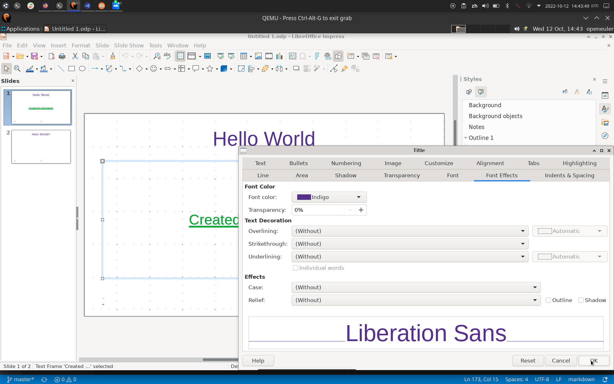

# 样式

## 摘要

打开「侧边栏」的「样式」窗格，其中列出可以应用与编辑的图形与演示文稿样式。

「LibreOffice Impress 中「样式」窗口的行为方式与其他 LibreOffice」程序不同。例如，您可以建立、编辑与应用「**图形样式**」，但只能编辑「**演示文稿样式**」。

## 操作步骤

要访问此命令...

F11.

Choose **View - Styles**.

Choose **Format - Styles - Manage Styles**.

## 预期结果

可以应用与编辑的图形与演示文稿样式。

## 其他说明

无。
