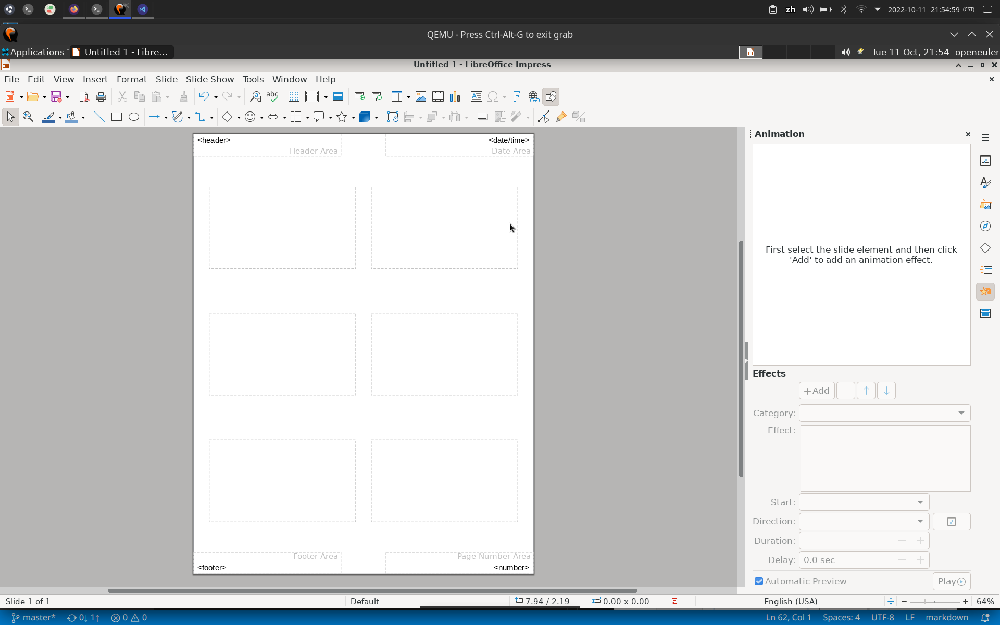

# 讲义视图

## 摘要

切换到「讲义」页面视图，在其中可以将多张幻灯片缩放到适合打印到一张纸上。

要修改单页打印的幻灯片数量，请打开「**属性**」侧边栏窗格并双击「**布局**」内容面板中的布局。

## 操作步骤

要访问此命令...

选择「**视图 - 讲义母版**」。

## 预期结果

切换到「讲义」页面视图，在其中可以将多张幻灯片缩放到适合打印到一张纸上。

## 其他说明

无。
