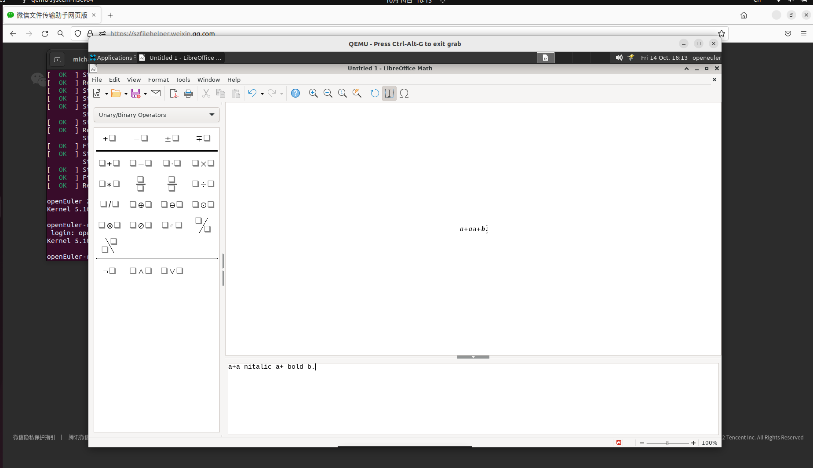

# 公式-修改默认属性

## 摘要

修改公式的默认属性。

## 操作步骤

说明：默认情况下，公式的某些部分始终保持粗体或斜体。

您可以使用 "nbold" 和 "nitalic" 删除这些属性。示例:

a + b

nitalic a + bold b.

在第二个公式中，a 不是斜体。b 是粗体。不能使用此方法修改加号。

截图：

## 预期结果

修改公式的默认属性成功。

## 其他说明

无。
