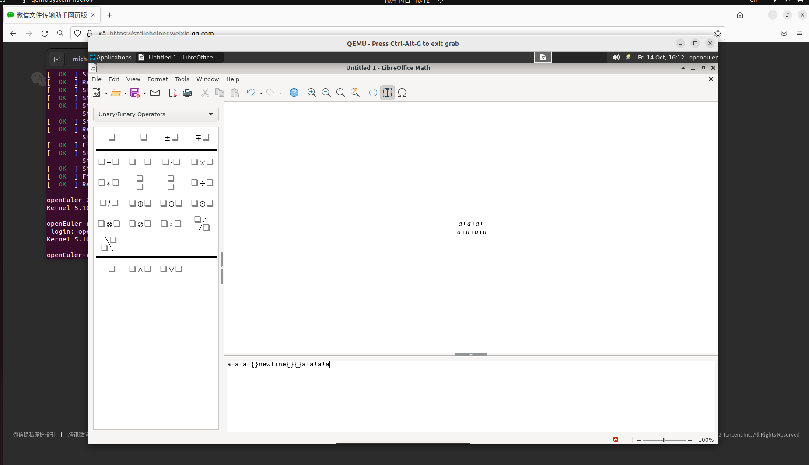

# 公式-手动对齐公式部分

## 摘要

手动对齐公式部分。

## 操作步骤

说明：您能够借助空字符组和字符串来获得对齐效果。它们虽然不占位置，却包含执行对齐的信息。

要创建空组，请在「命令」窗口中输入花括号「{}」。下例显示了进行换行以使加号垂直对齐 (尽管在上一行中少输入一个字符):

a+a+a+{} newline {}{}{}{}{}a+a+a+a

空字符串是确保文字和公式左对齐的简单方法，可使用双反向逗号 "" 进行定义。请确保未使用任何印刷上的反向逗号。示例:

"A further example." newline a+b newline ""c-d

截图：

## 预期结果

对齐公式部分成功。

## 其他说明

无。
