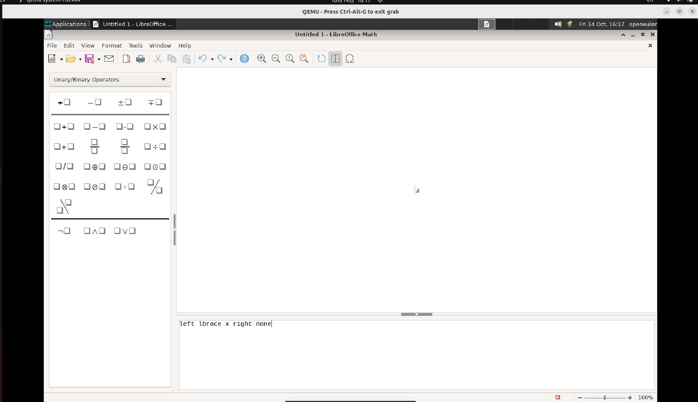

# 公式-插入括号

## 摘要

插入括号。

## 操作步骤

说明：您可以使用「左」和「右」设置单个括号，但是括号之间的间隔将不固定，因为它们取决于变量。但是，有一种方法可以使括号之间的间隔为固定值，即在标准括号之前加一个「\」 (反斜杠)。此时，可以像处理其他符号一样处理这些括号，并且括号的对齐方式也与其他符号相同:

left lbrace x right none

size *2 langle x rangle

size *2 { \langle x \rangle }

截图：

## 预期结果

插入括号成功。

## 其他说明

无。
