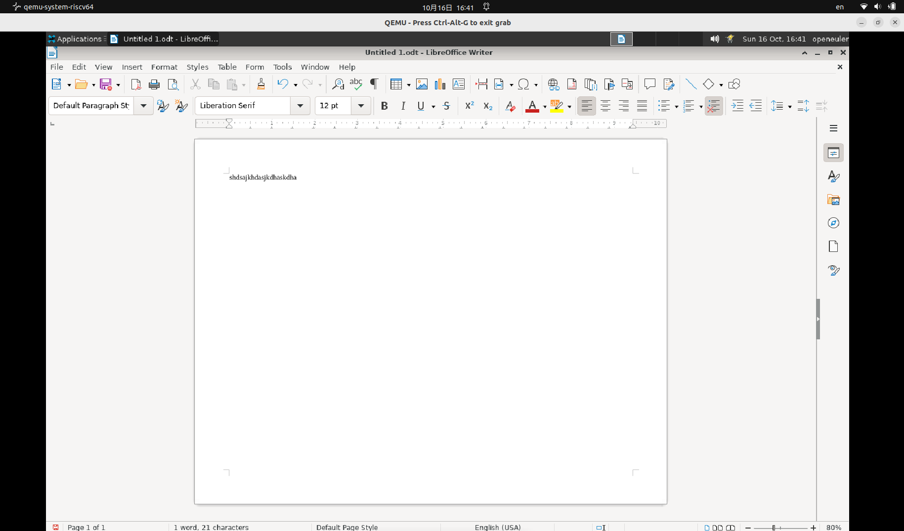

# 文本-修改页面方向

## 摘要

修改页面方向。

## 操作步骤

说明：
如果您的文本文档只存在相同的一个页面样式，您可以直接改变页面属性:

1、Choose Format - Page Style.

2、点击「页」选项卡。

3、在「纸张格式」下，选择「纵向」或「横向」。

4、点击「确定」。

截图：

## 预期结果

修改页面方向，从纵向变为横向。

## 其他说明

无。

