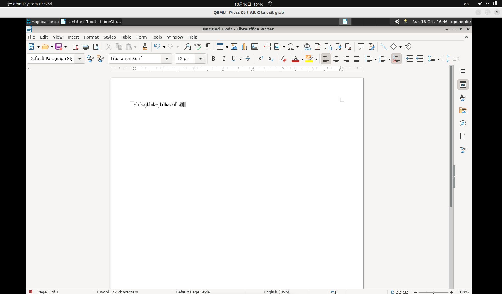

# 文本-隐藏文本-创建变量

## 摘要

对文本内容进行隐藏。

## 操作步骤

说明：
1、在文档中点击，然后选择「插入 - 字段 - 其他」。

2、点击「变量」选项卡，然后点击「类型」列表中的「设置变量」。

3、点击「格式」列表中的 "General"。

4、在「名称框中输入变量的名称，例如，Hide」。

5、在「值框中输入变量的值，例如 1」。

6、要在文档中隐藏该变量，请选择「不可见」。

7、点击「插入和关闭」。

截图：

## 预期结果

对文本内容隐藏成功。

## 其他说明

无。

