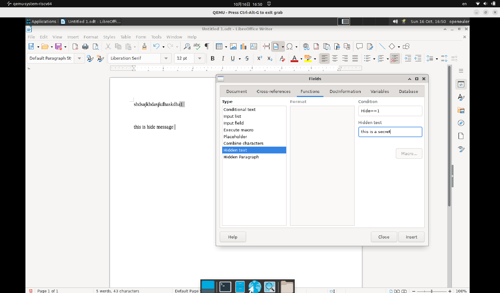

# 文本-隐藏文本-隐藏文字

## 摘要

隐藏文本中想隐藏的文字。

## 操作步骤

说明：
1、在文档中要添加文字的位置点击。

2、选择「插入 - 字段 - 其他」，然后点击「功能」选项卡。

3、在「类型」列表中点击「隐藏文字」。

4、在「条件框中输入一条语句。例如，如果使用您以前定义的变量，则输入 Hide==1」。

5、在「隐藏文字」框中输入要隐藏的文字。

6、点击「插入和关闭」。

截图：

## 预期结果

成功隐藏文本中想隐藏的文字。

## 其他说明

无。

