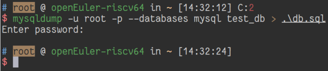

# 备份多个数据库

## 摘要

备份数据库 “mysql” 和 “test_db”。

## 操作步骤

1. 启动 Terminal
2. 执行 ```mysqldump -u root -p --databases mysql test_db > .\db.sql```
3. 输入密码并回车



## 预期结果

备份数据库成功。

## 其他说明

本测试用例面向 openEuler 操作系统，在此处供测试者参考。
