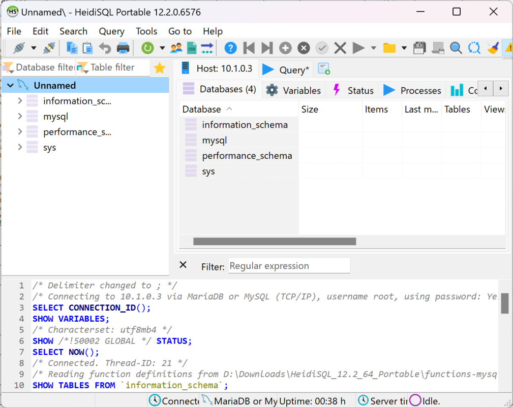

# 开启远程登入

## 摘要

允许 MySQL 用户：root 远程登入。

## 操作步骤

1. 更改 preview_start_vm.sh 文件，添加端口转发 ```-netdev user,id=usernet,hostfwd=tcp::"$ssh_port"-:22,hostfwd=tcp::3306-:3306```
2. 启动 OpenEuler
3. 启动 Terminal
4. 执行 ```sudo mysql_secure_installation```
5. 当询问 Disallow root login remotely? 时输入任意键选择 No
6. 执行 ```mysql -u root -p```
7. 输入密码并回车
8. 在 MySQL 中执行 ```GRANT ALL PRIVILEGES ON *.* TO 'root'@'localhost'; 与 UPDATE mysql.user SET host='%' WHERE user='root';```
9. 在 MySQL 中执行 ```exit```
10. 执行 ```sudo systemctl restart mysqld```
11. 通过第三方客户端等方式尝试远程登入



## 预期结果

远程登入成功。

## 其他说明

本测试用例面向 openEuler 操作系统，在此处供测试者参考。
