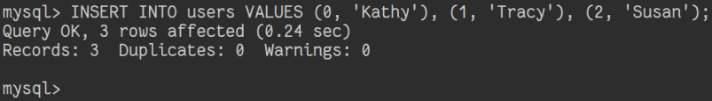

# 插入记录

## 摘要

在表格 “users” 中插入多条用户记录。

## 操作步骤

在 MySQL 中执行以下指令：

```
INSERT INTO users VALUES (0, 'Kathy'), (1, 'Tracy'), (2, 'Susan');
```



## 预期结果

插入记录成功。

## 其他说明

本测试用例面向 openEuler 操作系统，在此处供测试者参考。
