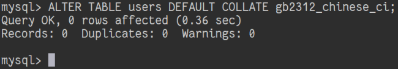

# 表格校对规则更改

## 摘要

将表格 “users” 的校对规则更改为 “gb2312_chinese_ci”。

## 操作步骤

在 MySQL 中执行 ALTER TABLE users DEFAULT COLLATE gb2312_chinese_ci;

## 预期结果

表格校对规则更改成功。

## 其他说明

本测试用例面向 openEuler 操作系统，在此处供测试者参考。
