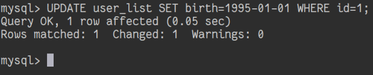

# 通过视图修改相应原始表格的记录

## 摘要

更改名为 “user_list” 的视图中 “id” 为 1 的记录中，字段 “birth” 的值。

## 操作步骤

在 MySQL 中执行以下指令：

```
UPDATE user_list SET birth=1995-01-01 WHERE id=1;
```



## 预期结果

更改记录成功。

## 其他说明

本测试用例面向 openEuler 操作系统，在此处供测试者参考。
