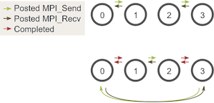
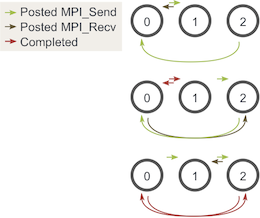

# 死锁以及预防说明

根据 [Wikipedia](https://zh.m.wikipedia.org/zh-cn/死锁) 的说法，死锁是指当两个以上的运算单元，双方都在等待对方停止执行，以获取系统资源，但是没有一方提前退出时，就称为死锁。在多任务操作系统中，操作系统为了协调不同线程，能否获取系统资源时，为了让系统正常运作，必须要解决这个问题。

代码将导致 MPI_Send 调用的循环链。

## 死锁及预防

值得注意的是，上面的代码在大多数情况下实际上不会“死锁”。尽管 MPI_Send 是一个阻塞调用，但是 MPI 规范表明 MPI_Send 会一直阻塞，直到可以回收发送缓冲区为止。这意味着当网络可以缓冲消息时，MPI_Send 将返回。如果发送最终无法被网络缓冲，它们将一直阻塞直到发布匹配的接收。在我们的例子中，有足够多的小发送和频繁匹配的接收而不必担心死锁，但是，永远不该假定有足够大的网络缓冲区。

由于在本文中我们仅关注 MPI_Send 和 MPI_Recv，因此避免可能发生的发送和接收死锁的最佳方法是对消息进行排序，以使发送将具有匹配的接收，反之亦然。 一种简单的方法是更改循环，以使偶数编号的进程在接收 walkers 之前发送传出的 walkers，而奇数编号的进程则相反。 在执行的两个阶段，发送和接收现在看起来像这样：

注意：使用一个进程执行此操作仍可能会死锁。为了避免这种情况，仅在使用一个进程时不要执行发送和接收。

您可能会问，这仍然适用于奇数个进程吗？ 我们可以通过三个过程再次查看相似的图表：

如您所见，在所有三个阶段中，至少有一个发布的 MPI_Send 与发布的 MPI_Recv 匹配，因此我们不必担心死锁的发生。
