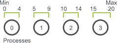
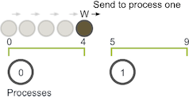

# 随机游走问题的并行化说明

在许多并行程序的应用中，首要任务是在各个进程之间划分域。随机行走问题的一维域大小为 Max - Min + 1（因为游走器包含 Max 和 Min）。假设游走器只能采取整数大小的步长，我们可以轻松地将域在每个进程中划分为大小近乎相等的块。例如，如果 Min 为 0，Max 为 20，并且我们有四个进程，则将像这样拆分域。

前三个进程拥有域的五个单元，而最后一个进程则拥有最后五个单元并且再加上一个剩余的单元。 一旦对域进行了分区，应用程序将初始化游走器。如前所述，游走器将以步长 S 进行总步数随机的游走。例如，如果游走器在进程 0（使用先前的分解域）上进行了移动总数为 6 的游走，则游走器的执行将如下所示：

游走器的步行长度开始增加。但是，当它的值达到 4 时，它已到达进程 0 的边界。因此，进程 0 必须与进程 1 交流游走器的信息。

进程 1 接收游走器，并继续移动，直到达到移动总数 6 。然后，游走器可以继续进行新的随机移动。

在此示例中，W 仅需从进程 0 到进程 1 进行一次通信。但是，如果 W 必须移动更长的距离，则可能需要沿其通过域的路径将其传递给更多的进程。
