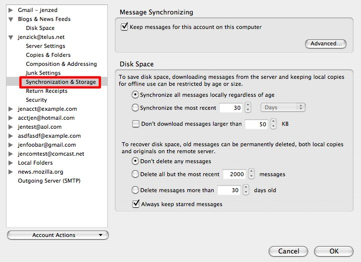
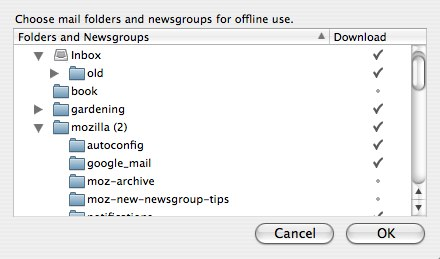
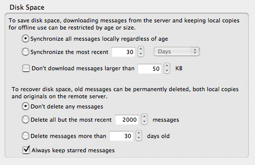

# IMAP 同步

> 查看对应的 [帮助文档](https://support.mozilla.org/zh-CN/kb/imap)

## 摘要

配置IMAP同步功能。

## 操作步骤

请打开账户设置对话框中的同步&存储(`工具 | 账户设置...`):

在页面顶部, **在此计算机中保留此账户的消息**选项应该勾选，如果你想在本机计算机和邮件服务器间同步邮件。

如果取消勾选此选项，则您可以单独指定要同步的文件夹。 点击 **高级...** 按钮:

被勾选的文件夹将被同步。子文件夹不会因为父文件夹被勾选就自动同步。相反，您必须单独勾选每一个子文件夹。

一般磁盘空间设置位于同步&存储页面的下半部分，您可以设置常规的同步偏好（例如同步最近一段时间内邮件或者同步某一尺寸以下的邮件）。

在页面的这部分也有批量删除邮件的选项（应当慎用）。

## 预期结果

成功设置IMAP同步功能。

## 其他说明

本文中，**预期结果**中不含有图片，但不影响测试者理解预期结果。

本测试用例面向openEuler操作系统，但本文使用的图片来源于官网帮助文件，因此图片中的Thunderbird可能是其他系统下的，界面并没有太大区别，在此处供测试者参考。
