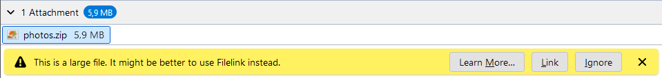
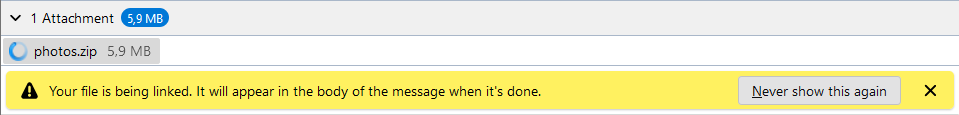
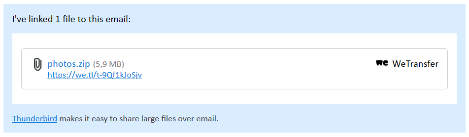

# 为大容量附件使用文件链接

> 查看对应的 [帮助文档](https://support.mozilla.org/zh-CN/kb/filelink-large-attachments)

## 摘要

可以把大文件上传到云，并只发送一个链接而不用直接添加邮件附件。

## 操作步骤

如果要使用 Filelink 功能，那么你首先要按照下面的指示安装一个[Filelink 提供者附加组件](https://addons.thunderbird.net/thunderbird/tag/filelink)。

对某些在线存储服务商，你可能需要首先创建帐号或者配置已有帐号。

1. 点击 `≡` > `首选项` > `撰写` > `附件` > `发现更多提供商`...
2. 选择一个 FileLink 提供者附加组件，并点击 `＋ 添加到 Thunderbird`。
3. 在弹出面板里用 `添加` 确认授权。
4. 在 首选项 的 `附件` 部分（如上），点击 `添加 [你选的 FileLink 提供者]`。
5. 添加附加组件需要的信息。
6. Thunderbird 以后会建议使用 FileLink 来发送大于 5 MB 的附件（大小可以在同样的地方修改），你也可以使用鼠标右键点击常规附件来转换发送方式。

**如果你添加附件时被提示附件太大需要使用 Filelink，那么可以勾选：[✓] 允许附件超过 [ 5] MB**

**你可以改变文件大小的阈值。**

当您将文件附加到邮件时，如果文件大小超过上述规定的数额，Thunderbird 会自动 Filelink 功能：

* 链接 `按钮`，将文件上传到在线存储服务提供商。
* 可点击 `忽略` 使用 传统附件。

点击 `链接` 选项，文件将会在后台上传，提示信息将变成：

不管文件大小和 Filelink 的通知，你总可以强制使用 Filelink 来发送附件：

* 选择撰写工具栏的向下的箭头 `附件` 按钮，打开 `Filelink` 子菜单。
* 右击附件并在弹出菜单里选择 `换成...` > `你选的 FileLink 提供者` 。你可以在你选的服务商列表中选一个。

链接完成后——就是说，附件已经上传到服务商——Thunderbird 会自动在邮件里添加如下的指向你的文件的链接信息：

## 预期结果

当收件人收到邮件时，将会看到同样的信息。点击邮件中的链接将为收件人打开附件对应的下载页面。

## 其他说明

注意：如果帐号的 以 HTML 格式撰写邮件 设置被关闭，那么链接的格式是纯文本的。

本文中，**预期结果**中不含有图片，但不影响测试者理解预期结果。

本测试用例面向 openEuler 操作系统，但本文使用的图片来源于官网帮助文件，因此图片中的 Thunderbird 可能是其他系统下的，界面并没有太大区别，在此处供测试者参考。
