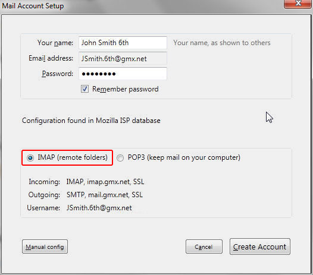

# 从 POP 账号到 IMAP 账号

> 查看对应的 [帮助文档](https://support.mozilla.org/zh-CN/kb/pop-imap)

## 摘要

把现有的 POP 账号变为 IMAP 账号。

## 操作步骤

### 禁用 POP 账号

为了避免重复检查新消息，你首先到账号设置`工具 > 账户设置`菜单，然后选择**服务器设置**并取消勾选**开启时检查新消息**和**每 XX 分钟检查一次新消息**。

### 新建 IMAP 账号

1. 打开`文件 > 新建 > 已有账号`菜单。
2. 通过[自动账户配置](https://github.com/GICEGreenIce/RISCV-testcase/blob/master/Thunderbird/testcase/%E8%87%AA%E5%8A%A8%E8%B4%A6%E6%88%B7%E9%85%8D%E7%BD%AE.md)的帮助设置账号。
3. 当它询问需要 POP 还是 IMAP 时，选择**IMAP（远端文件夹）**。

4. 新的 IMAP 账号就建好了，它列在现有账号的最下面。
5. 花点时间测试一下是否一切正常。检查特殊文件夹是否正确辨识（即，保存已发邮件的文件夹有特殊的图标，同样的，**回收桶**、**垃圾邮件**和**草稿**文件夹也是）。

## 预期结果

现有的 POP 账号变为 IMAP 账号。

## 其他说明

本文中，**预期结果**中不含有图片，但不影响测试者理解预期结果。

本测试用例面向openEuler操作系统，但本文使用的图片来源于官网帮助文件，因此图片中的Thunderbird可能是其他系统下的，界面并没有太大区别，在此处供测试者参考。
