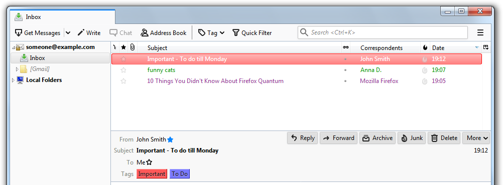
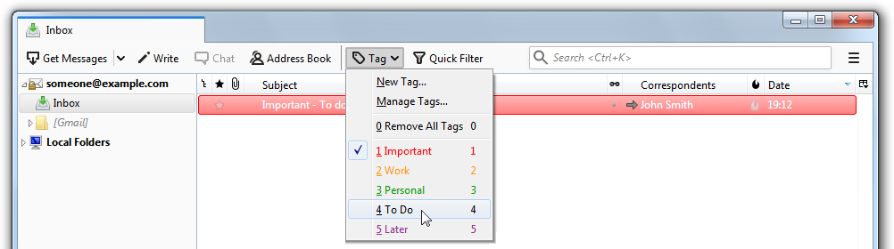
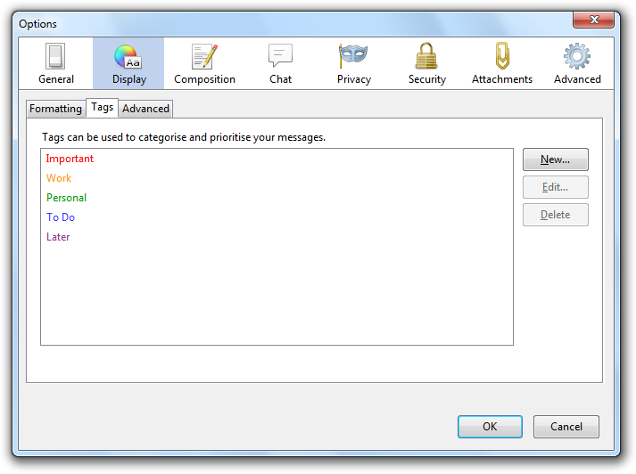
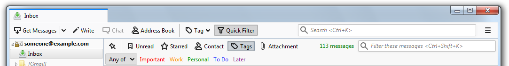

# 分类邮件

> 查看对应的 [帮助文档](https://support.mozilla.org/zh-CN/kb/%E9%82%AE%E4%BB%B6%E6%A0%87%E7%AD%BE-%E5%9C%A8Thunderbird%E4%B8%AD%E5%88%86%E7%B1%BB%E9%82%AE%E4%BB%B6）

## 摘要

使用快速筛选栏从列表中选择带有特定标记的消息。

## 操作步骤

### 标记一个邮件

1. 选择邮件。
2. 点击工具栏的 `标签` 按钮。
3. 点击想添加的标签。

**要移除一个标签，同样按照上述步骤。**

### 管理标签

如果想添加自己的标签，重命名现有的或简单地改变颜色，您可以使用 `首选项设置` 窗口：

1. 点击工具栏的 `标签` 按钮并选择菜单中的 `管理标签`。
2. 使用右边的按钮管理标签。

### 使用标签筛选邮件

1. 如果快速筛选栏隐藏，点击工具栏的 `快速筛选` 按钮显示。
2. 在快速筛选栏点击 `标签` 按钮。消息列表将缩小到包含至少一个标签的所有邮件。
3. 要将列表限制在具有特定标记的邮件，请点击工具栏中的标记名称。

## 预期结果

按类别组织电子邮件。

用各种颜色分别标记工作邮件。

使用快速筛选栏从列表中选择带有特定标记的消息。

## 其他说明

本文中，**预期结果**中不含有图片，但不影响测试者理解预期结果。

本测试用例面向 openEuler 操作系统，但本文使用的图片来源于官网帮助文件，因此图片中的 Thunderbird 可能是其他系统下的，界面并没有太大区别，在此处供测试者参考。
