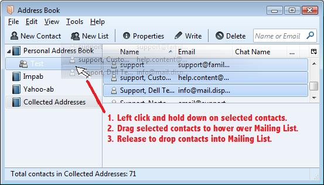
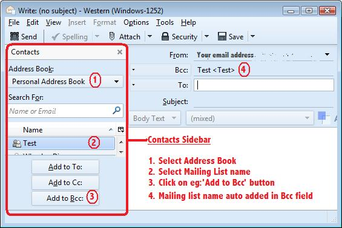

# 创建和使用邮件列表

> 查看对应的 [帮助文档](https://support.mozilla.org/zh-CN/kb/%E5%A6%82%E4%BD%95%E5%9C%A8Thunderbird%E4%B8%AD%E5%88%9B%E5%BB%BA%E5%92%8C%E4%BD%BF%E7%94%A8%E9%82%AE%E4%BB%B6%E5%88%97%E8%A1%A8#thunderbird:linux:tb102)

## 摘要

邮件列表是通讯录的子表。

一个通讯录可以包含多个邮件列表。

通讯录中任何包含有效电子邮件地址的联系人都可以加入邮件列表。

邮件列表用于给一组联系人发送电子邮件。

## 操作步骤

### 创建邮件列表

1. 打开通讯录。 
2. 选择 `文件 > 新建 > 邮件列表`。 
3. 取一个合适的列表名称。
4. 这时您有两个选项:

* 选项 1:

1. 手动输入您的联系人的电子邮件地址。
2. 一行输入一个电子邮件地址。
3. 您不可以在这个窗口的列表中给电子邮件地址排序，它们将按照添加顺序显示。
4. 完成后点击 **确定**。

* 选项 2:

1. 不要在这个窗口输入电子邮件地址。
2. 点击 **确定** 关闭这个窗口。
3. 选择包含您想加入这个邮件列表的联系人的通讯录。
4. 选择高亮联系人。
* 选择多个联系人：按住 "Ctrl" 键并单击联系人。
* 选择一个区块：选择第一个联系人，按住 "Shift" 键并选择最后一个联系人。
5. 左击并按住选中的高亮联系人，然后抓起。
6. 拖动联系人到左边，悬停在邮件列表上。
7. 释放鼠标按键，从而添加联系人到邮件列表。

### 使用邮件列表创建电子邮件

**有两种效果不同的方式。**

### 通过通讯录

在邮件工具栏，找到 **通讯录**。

1. 点击 **通讯录** 打开。
2. 选中邮件列表。
3. 点击 **新建消息** 按钮。

这会打开一个新的消息窗口，每个邮件列表中的联系人都将分开显示在 **收件人** 区域。若需要，您可以删除任意联系人。

如果您的联系人不希望您公开他们的电子邮件地址，您可能需要给每个电子邮件地址手动选择 **密件抄送**。

在主体文本处写电子邮件，并点击 **发送**。

### 通过新建消息

在邮件工具栏，找到 **新建消息** 按钮。

1. 点击 **新建消息** 按钮。
* 这会打开一个新的消息窗口，左侧是 '联系人侧栏'。
* 如果 **联系人侧栏** 不显示，您需要设置其显示。
* 点击 `查看 > 联系人侧栏` 或使用 "F9" 键来切换视图。
2. 选择包含邮件列表的通讯录。
3. 选择邮件列表。
4. 点击 **添加至密件抄送** 按钮或其他选项。

## 预期结果

正常创建和使用邮件列表。

## 其他说明

本文中，**预期结果**中不含有图片，但不影响测试者理解预期结果。

本测试用例面向 openEuler 操作系统，但本文使用的图片来源于官网帮助文件，因此图片中的 Thunderbird 可能是其他系统下的，界面并没有太大区别，在此处供测试者参考。
