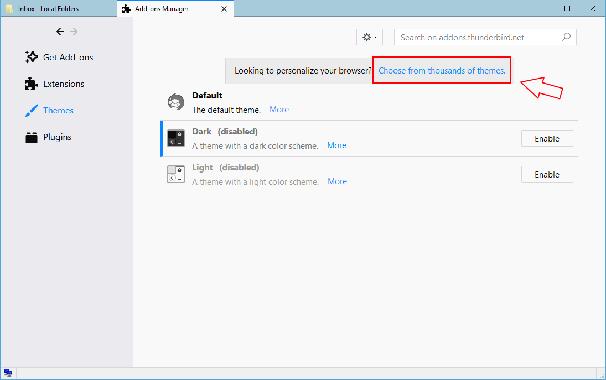
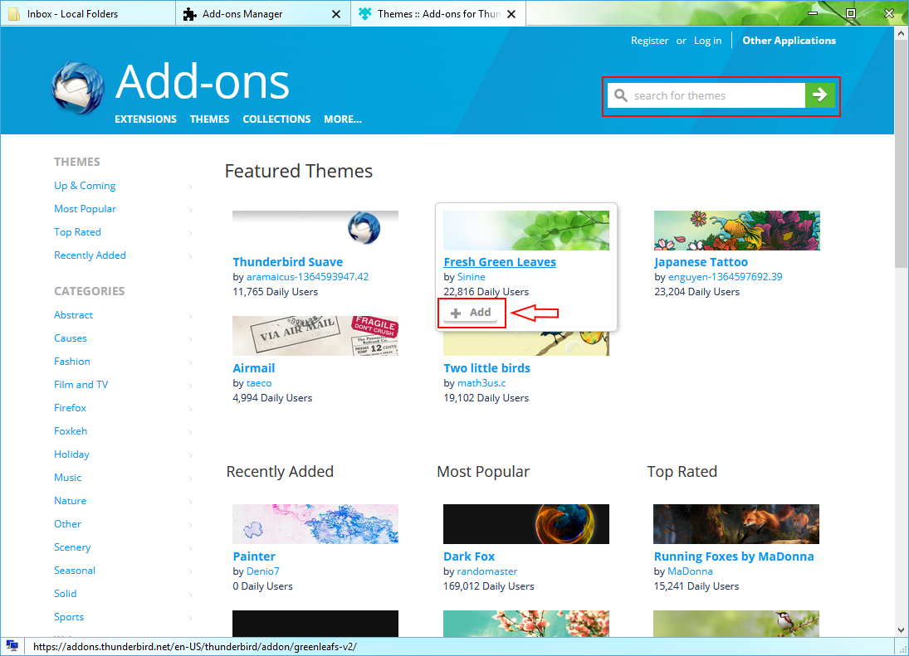

# 安装主题

> 查看对应的 [帮助文档](https://support.mozilla.org/zh-CN/kb/%E6%94%B9%E5%8F%98Thunderbird%E7%9A%84%E5%A4%96%E8%A7%82)

## 摘要

在 Thunderbird 的程序内搜索，安装和管理主题。

## 操作步骤

### 如何安装主题

1. 点击 `菜单` 按钮和选择 `Add-ons` 按钮。`添加主题` 按钮将会被打开。
2. 在添加主题窗口内选择 `主题` 这个面板。
3. 在标签的顶端，点击“选择更多主题”。

4. 在标签内容的页面，你可以在页面上或者用在右上方搜索栏搜索主题你想要的主题。

5. 如果满意一个主题，点击灰色的 `添加` 按钮去安装它。
6. Thunderbird 将会下载你所要的主题，并会向你核实一下是否要安装它。

## 预期结果

在 Thunderbird 的程序内搜索，安装和管理主题。

## 其他说明

本文中，**预期结果**中不含有图片，但不影响测试者理解预期结果。

本测试用例面向 openEuler 操作系统，但本文使用的图片来源于官网帮助文件，因此图片中的 Thunderbird 可能是其他系统下的，界面并没有太大区别，在此处供测试者参考。
