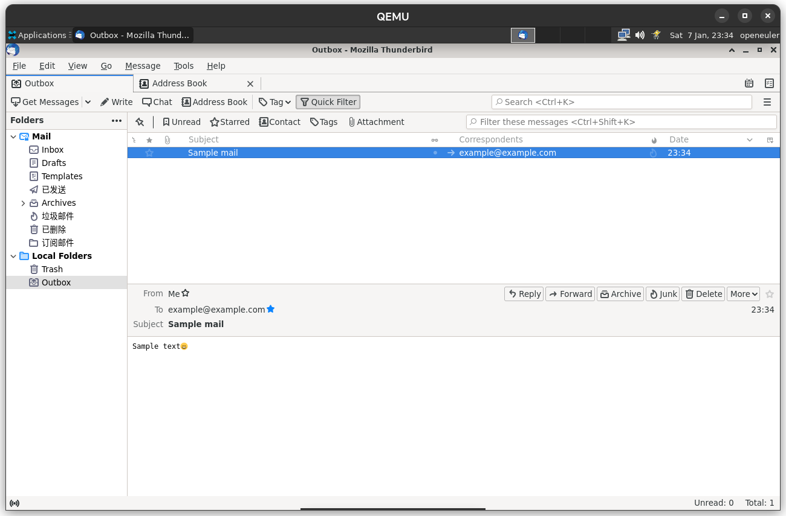

# 延迟发送邮件

## 操作步骤

1. 点击菜单栏上的 File -> New -> Message，或按 Ctrl + N 打开新邮件对话框。
2. 在打开的新邮件对话框中，点击菜单栏上的 File->Send Later 延迟发送邮件。

## 预期结果

显示延迟发送时间的对话框，选择要延迟发送的时间。

## 实际结果

延迟发送时间对话框未出现，邮件被直接移动到 Outbox 文件夹中。

