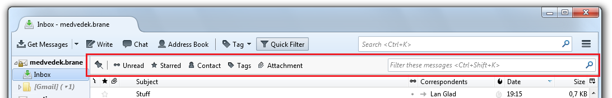
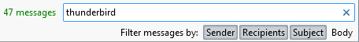

# 快速筛选工具

> 查看对应的 [帮助文档](https://support.mozilla.org/zh-CN/kb/%E5%BF%AB%E9%80%9F%E7%AD%9B%E9%80%89%E5%B7%A5%E5%85%B7#thunderbird:linux:tb102)

## 摘要

限制在邮件列表中显示的邮件数。

## 操作步骤

在搜索框中输入筛选条件后，您可以选择将其应用于列表中邮件的发件人、收件人、主题、 正文。

工具栏左侧的按钮可以单独使用，也可以与筛选字段中输入的字符组合使用。

## 预期结果

显示来自特定发件人或包含特定字词或具有附件的邮件。

## 其他说明

本文中，**预期结果**中不含有图片，但不影响测试者理解预期结果。

本测试用例面向 openEuler 操作系统，但本文使用的图片来源于官网帮助文件，因此图片中的 Thunderbird 可能是其他系统下的，界面并没有太大区别，在此处供测试者参考。
