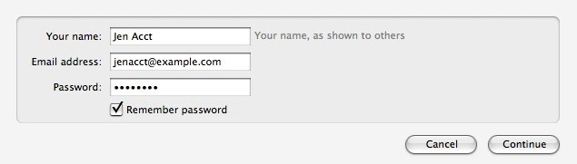
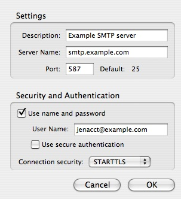
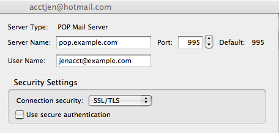

# 手动帐号配置

> 查看对应的 [帮助文档](https://support.mozilla.org/zh-CN/kb/%E6%89%8B%E5%8A%A8%E5%B8%90%E5%8F%B7%E9%85%8D%E7%BD%AE)

## 摘要

手动进行账号配置。

## 操作步骤

在手动设置帐户时，您需要准备一下的资料，这些资料都可以从您的邮件服务商那里取得。

* 收件服务器和端口 （例如 "pop.example.com"、端口 110，或者 "imap.example.com"、端口 143）
* 发件服务器和端口（例如 "smtp.example.com"和端口 25）
* 安全服务器连接设置（例如 "STARTTLS" 或者 "SSL/TLS" 以及是否需要使用安全认证）

首先，打开帐户设置: 在Thunderbird菜单栏，点击`工具`菜单并选择`账户设置`，或点击`应用菜单按钮`并在子菜单里选择`选项`和`账号设置`。

页面左侧会列出之前已经设置的电子邮件和新闻群组帐户。这些帐户与“全部文件夹”列表中最上层的文件夹对应。

在做侧面板底部，点击**帐户设置**按钮，然后选择**添加邮件帐户**...。

输入您的邮件帐户资料后点击**继续**。 

Thunderbird 就会尝试根据您邮件的域名来判定相关设置（就是 "@" 图标后面的部分）。

然后点击**手动设置**按钮并编辑服务器名称、端口以及MAP/POP来手动设置账号。点击**重新测试**来测试手动设置；马上就会有测试结果给出设置是否有效。

如果不是有效，请点击**停止**按钮中断查找，然后编辑服务器名字，端口和IMAP/POP，再点击**重新测试**按钮。

### 设置发件服务器

多个邮件帐户可以使用相同的 SMTP 发件服务器。 因此，SMTP 服务器的设置与邮件帐户是分开的。

在**帐户设置**对话框左侧窗格的最下方中选择**发件服务器 (SMTP)**。 

就能看到添加帐户时输入的服务器信息，您也可以编辑或者添加新的收件服务器。

作为一个例子，一个 Gmail 帐户设置如下：

* 服务器名称：smtp.gmail.com
* 端口：587
* 使用用户名和密码：选中
* 用户名：不包括"gmail@com"部分的您的 Gmail 用户ID（例如，如果您的电子邮件地址为 brian@gmail.com, 那么您的用户名就是 "brian"）。如果您使用 Google Apps 自定域，则应使用您的完整地址（例如，"billsmith@yourdomain.com"）。
* 连接安全性：STARTTLS

在保存完添加的发件服务器之后，从列表中选择新的邮件帐户。

在 **发件服务器(SMTP)** 选项中, 在下拉菜单中选择 SMTP 服务器。

其他选项将在您输入帐户信息时自动填充，当然您也可以修改或补充。

在您的新帐户中点击**服务器设置**选项。确认以下输入符合邮件提供商要求的设置。

## 预期结果

在保存完这些更改之后，您就可以收发邮件了。其他的帐户设置则是可选的，而且也比较简明易懂。

## 其他说明

本文中，**预期结果**中不含有图片，但不影响测试者理解预期结果。

本测试用例面向openEuler操作系统，但本文使用的图片来源于官网帮助文件，因此图片中的Thunderbird可能是其他系统下的，界面并没有太大区别，在此处供测试者参考。
