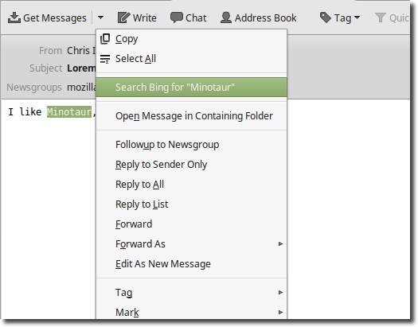

# 搜索

> 查看对应的 [帮助文档](https://support.mozilla.org/zh-CN/kb/%E6%89%93%E5%BC%80%E6%90%9C%E7%B4%A2)

## 摘要

### 如何执行搜索

当您看到 "I like Minotaur" 这个短语，并且想在网上搜索 Minotaur。只需要选中 "Minotaur"，然后右击选择 用 Bing 搜索 "Minotaur"

### 如何更改搜索引擎

默认情况下，Bing 被设置为搜索引擎。如要更改，请执行以下操作：

点击 Thunderbird 窗口顶部的 `编辑` 菜单，选择 `首选项`，或点击菜单按钮后选择 `首选项`。
选择 `常规` 面板。
在 **默认搜索引擎** 下，请使用下拉菜单从列表中选择首选搜索引擎。
点击 `关闭` 关闭 `首选项` 窗口。

## 预期结果

正常使用 Thunderbird 进行搜索。

## 其他说明

本文中，**预期结果**中不含有图片，但不影响测试者理解预期结果。

本测试用例面向 openEuler 操作系统，但本文使用的图片来源于官网帮助文件，因此图片中的 Thunderbird 可能是其他系统下的，界面并没有太大区别，在此处供测试者参考。
