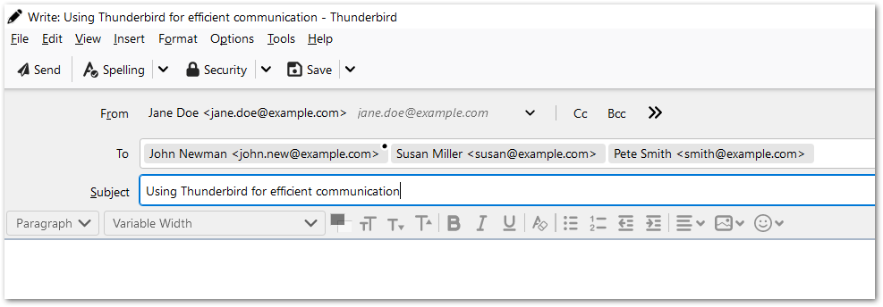

# 收发消息

> 查看对应的 [帮助文档](https://support.mozilla.org/zh-CN/kb/%E7%94%A8%20Thunderbird%20%E6%94%B6%E5%8F%91%E6%B6%88%E6%81%AF#thunderbird:linux:tb102)

## 摘要

用 Thunderbird 收发消息。

## 操作步骤

1. 在 Thunderbird 工具栏，点击 `编写` 按钮。`编写` 窗口会打开。

2. 在 `收件人` 栏填写收件人的邮件地址。对每个地址按下 `回车` 或 `Tab` 按键，这些地址就会变成收件人条目（收件人 pill）。

    你还可一使用 `抄送` 和 `密送` 按钮或 >> 按钮来增加其他类型的收件人。

    输入完所有收件人后，再按下 `回车` 键就可以进入标题栏。
    
 
 
3. 在 `标题` 栏，输入消息标题，然后按 `回车` 键进入消息面板。

4. 在消息面板编写消息。

点击 `发送` 按钮，或 `Ctrl + 回车`。

## 预期结果

正常使用 Thunderbird 进行邮件收发。

## 其他说明

本文中，**预期结果**中不含有图片，但不影响测试者理解预期结果。

本测试用例面向 openEuler 操作系统，但本文使用的图片来源于官网帮助文件，因此图片中的 Thunderbird 可能是其他系统下的，界面并没有太大区别，在此处供测试者参考。
