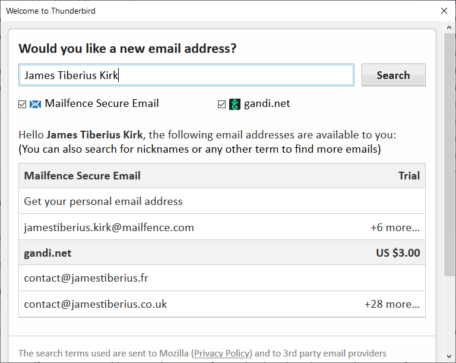

# 新域名的电子邮件地址

> 查看对应的 [帮助文档](https://support.mozilla.org/zh-CN/kb/%E6%96%B0%E5%9F%9F%E5%90%8D%E7%9A%84%E7%94%B5%E5%AD%90%E9%82%AE%E4%BB%B6%E5%9C%B0%E5%9D%80)

## 摘要

建立和托管您的个性化电子邮件账户。

## 操作步骤

当你第一次启动 Thunderbird，或者选择 文件 > 新建 > 获取一个新的电子邮件帐号，您将看到从电子邮件服务提供商获得一个全新电子邮件账户的选项。

在顶部输入您想要使用的新的电子邮件地址域名的名字，选择所需的供应商然后点击 查找。

您选择的电子邮件服务提供商将基于您输入的名字显示可用的电子邮件域名。您可以更换您输入的名字并再次查找，直到找到您最喜欢的电子邮件域名。

如果电子邮件服务提供商对账户收费，收费数额将会被显示。

通过点击收费数额按钮，选择你想要获得的域名地址。系统将提示您在电子邮件服务提供商的网站上创建账户，并且配置支付和其他选项。

新账户创建完成之后，Thunderbird 将自动对其进行配置，让您可以立即使用新账户。

## 预期结果

新账户创建完成之后，Thunderbird 将自动对其进行配置，让您可以立即使用新账户。

## 其他说明

本文中，**预期结果**中不含有图片，但不影响测试者理解预期结果。

本测试用例面向openEuler操作系统，但本文使用的图片来源于官网帮助文件，因此图片中的Thunderbird可能是其他系统下的，界面并没有太大区别，在此处供测试者参考。
