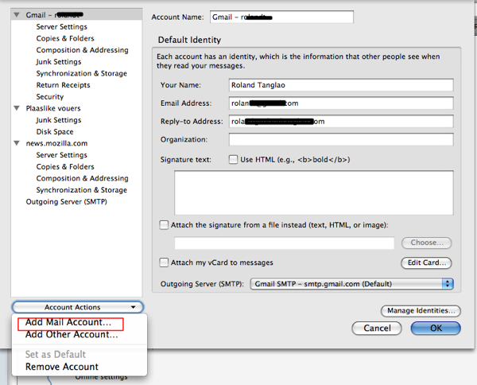
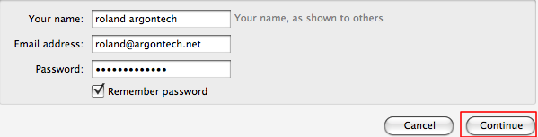
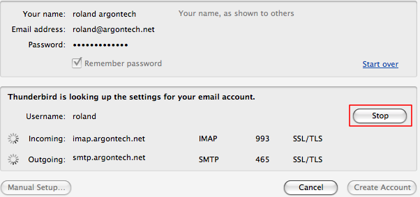
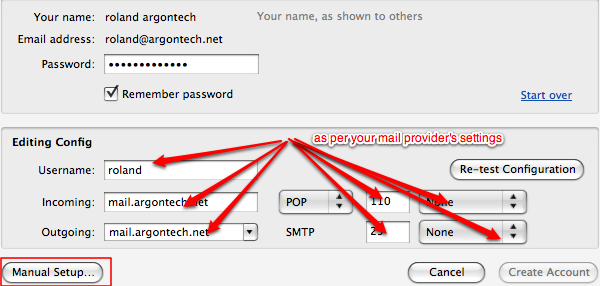
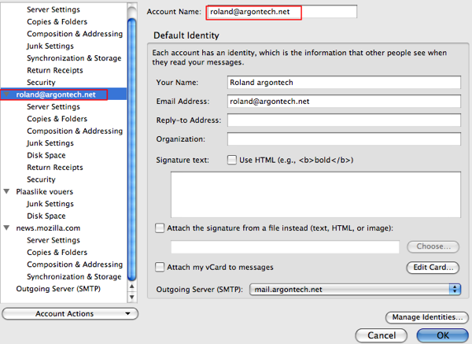

# 更改 IMAP 为 POP

> 查看对应的 [帮助文档](https://support.mozilla.org/zh-CN/kb/%E6%9B%B4%E6%94%B9IMAP%E4%B8%BAPOP)

## 摘要

配置邮件服务器，将协议IMAP更改为POP。

## 操作步骤

1. 选择**工具 | 帐户设置... | 帐户操作 | 添加邮件帐户**。

2. 输入您的用户名（检查您的邮件提供商；完整的电子邮件地址）和密码，然后点击**继续**。

3. Thunderbird 将尝试使用 IMAP 自动配置您的帐户设置。点击**停止**。

4. 输入您的帐户详细信息，如下所示：
* 用户名：输入您的完整电子邮件地址（或电子邮件提供商推荐的任何内容，通常是您的完整电子邮件地址，但有时只是 "@" 之前的部分）。
* 接收：输入您的接收电子邮件提供商的服务器（通常是 "mail.yourmailprovider.com" 或 "pop.yourmailprovider.com"，例如 "mail.argontech.net"）。
* 发送：输入您的发送电子邮件提供商的服务器（通常是 "mail.domainname.com" 或 "smtp.domainname.com"）。
* 在接收邮件服务器名称右侧的下拉列表中（屏幕截图中标记为 “接收：” 的行）选择 "POP"。 **这很重要，因为如果选择 IMAP，您将无法将其更改为 POP！**
* 接收端口号：这取决于电子邮件提供商。
* 发送端口号：这取决于电子邮件提供商。
* 接收安全性：这取决于电子邮件提供商。
* 发送安全性：这取决于电子邮件提供商。

5. 输入这些设置后，点击**手动设置...**

6. 点击**取消**退出 “帐户设置” 对话框。重新打开 “帐户设置” 页面，您会看到新帐户已创建。此外，请检查帐户的发送服务器（SMTP）是否正确（在截图的底部）。

7. 检查接收和发送邮件是否正常工作。

## 预期结果

将邮件服务器协议从IMAP更换至POP，并且软件可以正常收发电子邮件。

## 其他说明

本文中，**预期结果**中不含有图片，但不影响测试者理解预期结果。

本测试用例面向openEuler操作系统，但本文使用的图片来源于官网帮助文件，因此图片中的Thunderbird可能是其他系统下的，界面并没有太大区别，在此处供测试者参考。
