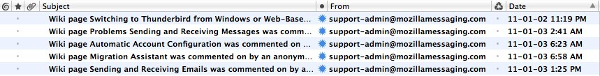
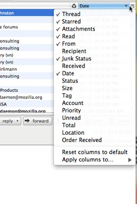

# 消息列表栏

> 查看对应的 [帮助文档](https://support.mozilla.org/zh-CN/kb/%E6%B6%88%E6%81%AF%E5%88%97%E8%A1%A8%E6%A0%8F)

## 摘要

消息列表栏显示一组包含每个消息属性的列，例如消息主题、日期等。

## 操作步骤

### 添加或删除列

上面的屏幕截图显示了默认的列布局。 单击标签栏最右侧的列选择按钮查看可用列的列表。或者，您可以右键单击任何列标签以显示列表。

单击列表中选中的项目可从消息列表中删除列。单击列表中未选中的项目可将列添加到消息列表中。

### 移动或调整列大小

要移动列，请单击列标题并将其拖动到所需位置。要调整列大小，请将光标滚动到列标题的右侧。当光标从单个指针变为双指针时，将列边缘拖动到所需位置。

## 预期结果

显示一组包含每个消息属性的列，例如消息主题、日期等。

## 其他说明

本测试用例面向 openEuler 操作系统，但本文使用的图片来源于官网帮助文件，因此图片中的 Thunderbird 可能是其他系统下的，界面并没有太大区别，在此处供测试者参考。
