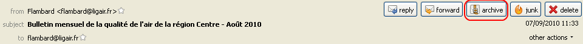
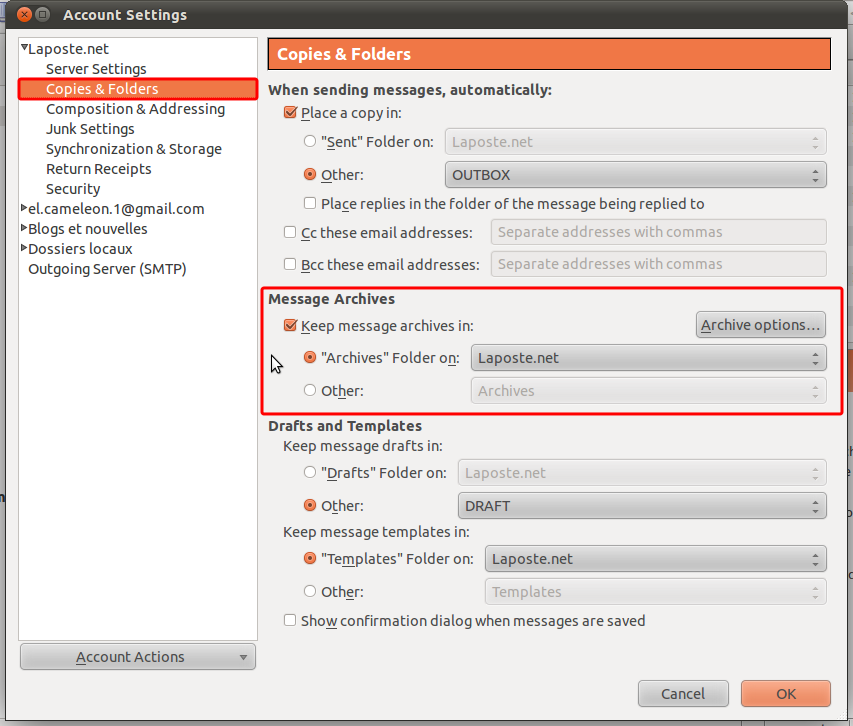
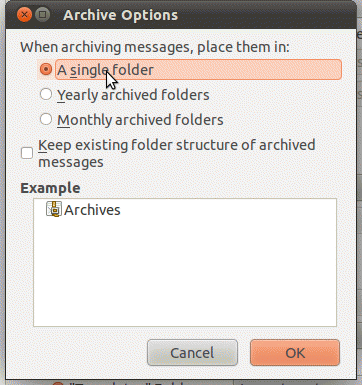

# 消息的归档

> 查看对应的 [帮助文档](https://support.mozilla.org/zh-CN/kb/%E6%B6%88%E6%81%AF%E7%9A%84%E5%BD%92%E6%A1%A3)

## 摘要

将消息从其默认目录转移到归档目录。

## 操作步骤

选择需要归档的消息，然后点击 `归档` 按钮, 或者敲击 `键盘` 上的 `A` 就可以使选中的消息归档。

建议使用此功能时一次不要选择超过2000条消息。

### 配置归档位置

每个邮箱账户都可以配置自己的归档位置。打开菜单 `编辑 > 账户设置`， 在左边选择需要配置的账号，然后选择 `副本和文件夹` 。

针对 `消息存档` 部分，修改 `保存消息存档至` 来指定归档位置。

### 配置归档文件夹

点击 **归档选项...** 按钮可以配置归档文件夹。 如下动画所示，可以使用单个文件夹来归档，也可以使用一些子文件夹来归档：

## 预期结果

将消息从其默认目录转移到归档目录。

使消息条理化、容易转移至备份设备，并保持收件箱清洁。

## 其他说明

本文中，**预期结果**中不含有图片，但不影响测试者理解预期结果。

本测试用例面向 openEuler 操作系统，但本文使用的图片来源于官网帮助文件，因此图片中的 Thunderbird 可能是其他系统下的，界面并没有太大区别，在此处供测试者参考。
