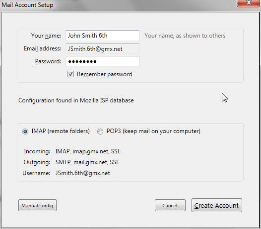
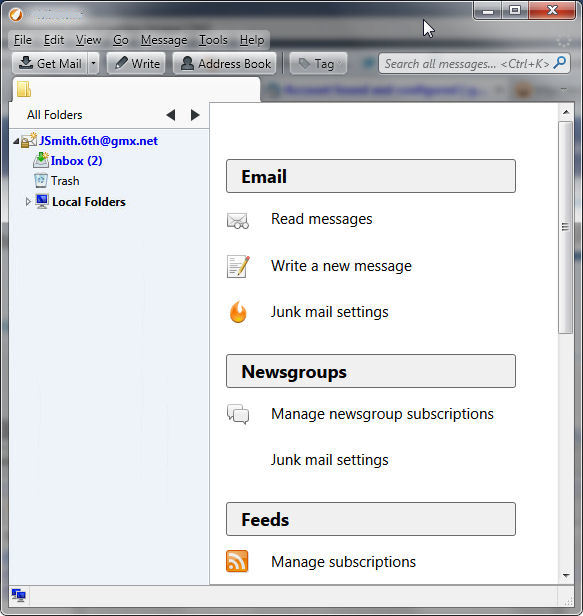

# 自动账户配置

> 查看对应的 [帮助文档](https://support.mozilla.org/zh-CN/kb/%E8%87%AA%E5%8A%A8%E8%B4%A6%E6%88%B7%E9%85%8D%E7%BD%AE)。

## 摘要

设置自动配置的账户。

## 操作步骤

当安装之后您首次打开 Thunderbird 时，您被提示创建一个配置文件。（在这步请关闭任何试图创建邮件服务的窗口再继续）。

接下来您将被要求在一个如下所示的对话框中提供您电子邮件帐号的细节。这个对话框同样也在您添加新电子邮件帐号时显示（使用文件 > 新建 > 现有邮件帐号... 或通过 帐号设置）。

另一个添加新帐号的途径是点击一个现有帐号名称（显示的电子邮件地址）。

在“账户”的标题下有两个选项："查看此账户设置"和"设置一个账户"。

在"设置一个账户"选项下，点击“电子邮件”显示如下所示的对话框。

当您按下`继续`， Thunderbird 将寻找电子邮件服务商并试图确定服务器的设置。

在上面的例子中，服务商的数据已经被用来填写账户细节以及配置所提供的服务。

* 接收邮件：IMAP 在 imap.gmx.net，使用安全套接层（SSL）

* 外发邮件：SMTP 在 mail.gmx.net，使用 SSL

您可以选择 IMAP 或 POP 作为您接收邮件的协议。IMAP 和 POP 是标准的电子邮件接收协议。

IMAP 是更现代的协议，允许您同时将消息保存在邮件服务器上和本地计算机中。

POP 协议仅允许消息在本地保存。电子邮件服务商也许提供 IMAP 接入或 POP 接入，或者两者同时支持。

完成帐号设置：

* 创建帐号: 按下这个按钮创建帐号。
* 取消： 放弃自动创建帐号。
* 手动设置...: 手动设置帐号。Thunderbird 将创建一个包含所显示细节的新帐号，并且打开 帐号设置 对话以便您能够做进一步的变更。

## 预期结果

创建帐号之后，Thunderbird 会显示新帐号：

## 其他说明

本测试用例面向 openEuler 操作系统，但本文使用的图片来源于官网帮助文件，因此图片中的 Thunderbird 可能是其他系统下的，界面并没有太大区别，在此处供测试者参考。
