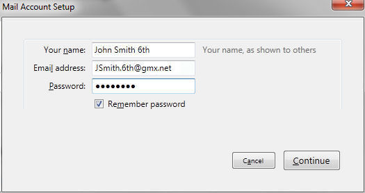

# 自动账户配置

> 查看对应的 [帮助文档](https://support.mozilla.org/zh-CN/kb/%E8%87%AA%E5%8A%A8%E8%B4%A6%E6%88%B7%E9%85%8D%E7%BD%AE)。

## 摘要

设置自动配置的账户。

## 操作步骤

当安装之后您首次打开 Thunderbird 时，您被提示创建一个配置文件。（在这步请关闭任何试图创建邮件服务的窗口再继续）。

接下来您将被要求在一个如下所示的对话框中提供您电子邮件帐号的细节。这个对话框同样也在您添加新电子邮件帐号时显示（使用文件 > 新建 > 现有邮件帐号... 或通过 帐号设置）。

另一个添加新帐号的途径是点击一个现有帐号名称（显示的电子邮件地址）。

在“账户”的标题下有两个选项："查看此账户设置"和"设置一个账户"。

在"设置一个账户"选项下，点击“电子邮件”显示如下所示的对话框。

